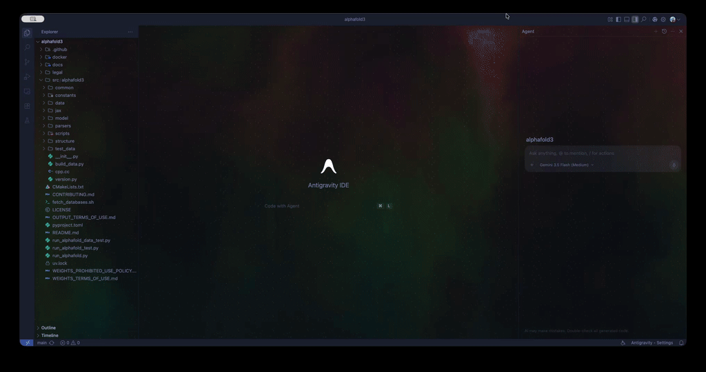

# Aurora — live animated background for VS Code & Antigravity

A slow, iridescent aurora shader that renders **behind your code editor**. It's a single
self-contained file (`aurora-vscode.js`) — WebGL shader + the styling needed to make the
editor surfaces see-through, all in one.



> **Antigravity users:** Antigravity is built on VS Code, so every step below is identical —
> just substitute "Antigravity" wherever it says "VS Code" (including the app name when you
> grant file permissions). The extension, settings, and commands are the same.

---

## What you get

- A calm, always-moving aurora behind your editor, sidebar, and panels.
- Theme-aware: sticky scroll keeps **your color theme's own colors**, so pinned lines stay readable.
- A small `CONFIG` block at the top of the file to tune brightness, dimming, speed, minimap, and sticky-scroll opacity.

---

## Requirements

- VS Code or Antigravity (any recent version).
- The **Custom CSS and JS Loader** extension:
  - `be5invis.vscode-custom-css` (for Visual Studio Marketplace / VS Code)
  - `s-h-a-d-o-w.vscode-custom-css` (for Open-VSX / Antigravity)

> ⚠️ This works by injecting a script into the editor's UI. It's a popular but **unofficial**
> approach — read [Things to know](#things-to-know) before you start.

---

## Install

### 1. Install the loader extension
Open the Extensions panel and search for **"Custom CSS and JS Loader"** → **Install**.
- **Visual Studio Marketplace:** publisher *be5invis* (`be5invis.vscode-custom-css`)
- **Open-VSX:** publisher *s-h-a-d-o-w* (`s-h-a-d-o-w.vscode-custom-css`)

### 2. Save the Aurora file somewhere permanent
Put `aurora-vscode.js` in a stable folder — e.g. `~/aurora/aurora-vscode.js`.
If you later move or delete it, the background disappears.

### 3. Point your editor at it
Open your settings JSON: Command Palette (`Cmd/Ctrl+Shift+P`) → **"Preferences: Open User Settings (JSON)"** — and add:

```jsonc
"vscode_custom_css.imports": [
  "file:///Users/YOURNAME/aurora/aurora-vscode.js"
]
```

Path format by OS:
- **macOS / Linux:** `file:///absolute/path/aurora-vscode.js`
- **Windows:** `file:///C:/Users/YOURNAME/aurora/aurora-vscode.js`

### 4. Enable it
Command Palette → **"Enable Custom CSS and JS"** → click **Restart** when prompted.

That's it — the aurora should now be drifting behind your code.

---

## Tuning

Open `aurora-vscode.js` and edit the `CONFIG` block at the top:

```js
const CONFIG = {
  opacity: 0.60, // how visible the aurora is behind your code   (0 – 1)
  dim:     0.45, // extra dark scrim for text readability         (0 – 1)
  speed:   1.00, // motion speed multiplier                       (0.2 – 3)
  minimap: 0.45, // minimap translucency so aurora shows through  (0 = invisible, 1 = solid)
  sticky:  0.92, // sticky-scroll backing opacity (uses your THEME's color)
};
```

After any change, run Command Palette → **"Reload Custom CSS and JS"**.

**Tips**
- Hard to read your code? Raise `dim` or lower `opacity`.
- Want the minimap fully solid again? Set `minimap: 1` (or disable it in settings with `"editor.minimap.enabled": false`).
- Want sticky scroll fully opaque? Set `sticky: 1`.
- A **dark color theme** looks best, since some theme surfaces stay tinted.

---

## Things to know

This extension patches the editor's own UI files, which has a few side effects:

- **"Your installation appears corrupt" warning** — expected; it just means a UI file was modified.
  Click the gear icon → **"Don't Show Again"**.
- **Re-enable after every update** — app updates overwrite the patch. Just run
  **"Enable Custom CSS and JS"** again.
- **Permissions (macOS)** — if enabling fails, the app can't write to its own folder. Grant access with:
  ```bash
  # VS Code
  sudo chown -R $(whoami) "/Applications/Visual Studio Code.app/Contents/Resources/app"
  # Antigravity (adjust the app name/path to match your install)
  sudo chown -R $(whoami) "/Applications/Antigravity.app/Contents/Resources/app"
  ```

---

## Uninstall

1. Command Palette → **"Disable Custom CSS and JS"**.
2. Remove the `vscode_custom_css.imports` entry from your settings JSON.
3. (Optional) Uninstall the **Custom CSS and JS Loader** extension and delete `aurora-vscode.js`.

---

## How it works (short version)

The script does two things:

1. **Makes the editor see-through** — most VS Code surfaces read their background from CSS
   variables (e.g. `--vscode-editor-background`); the script blanks those, plus a handful of
   elements that hardcode a background. Pop-ups and sticky scroll are kept readable on purpose.
2. **Draws the aurora** — a full-window WebGL `<canvas>` is placed *behind* the workbench
   (with a dark scrim for contrast) and runs a noise-based shader every frame. No images, no
   video — just math, redrawn live.
